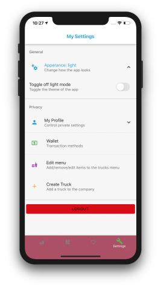
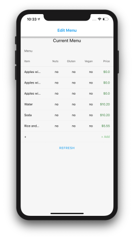
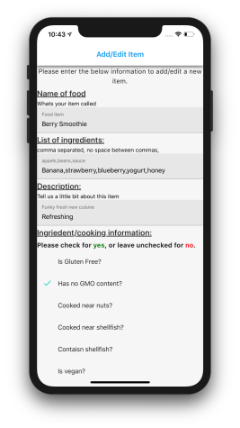
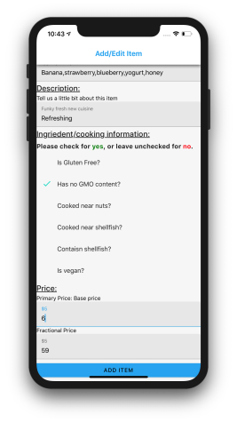
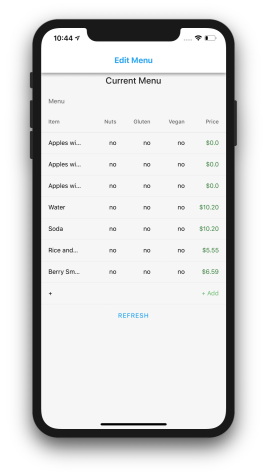

# Adding a menu to a company

Inorder to to add menu items to a company, a user first must be part of the company and a truck driver. To do so follow the steps found [here](/user_docs/register_as_driver/)

## Steps to add menu to item

- First proceed to the settings tab, you will see a purple icon called `Edit Menu`

- After selecting the `Edit Menu`, you will see the current menu with an option at the bottom saying `add`.

- You will then see a form asking you to fill in information about the menu item.

- Then after going back to the menu (you have to click refresh) you should see your newly created item!

